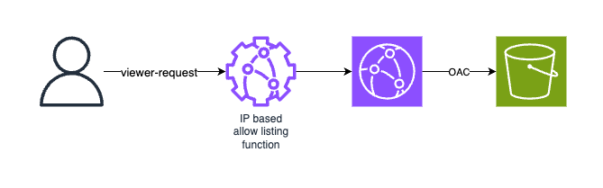

# IP-Based request filtering for builds and api docs pages

serving location:

- builds: cloudfront-s3
- apiDocs: waf-alb-ecs

## For builds

A Function will do the filtering

### ways to do this-

- lambda@edge
- cloudfront functions

[diff b/w 'em](https://docs.aws.amazon.com/AmazonCloudFront/latest/DeveloperGuide/edge-functions-choosing.html)

cf fns limits

- max mem 2mb - don't know about the mem usage in cloudfront2.0 runtime
- max (code + deps size) 10kb... (are the aws sdk deps included in this?)
- no external requests... no fetch, no fs, no os
- fn log where? and how?

## For api docs

Using WAF rules

- A waf rule on /api/apiDocs to deny all ips
- A WAF rule on /api/apiDocs to allow certain ips
